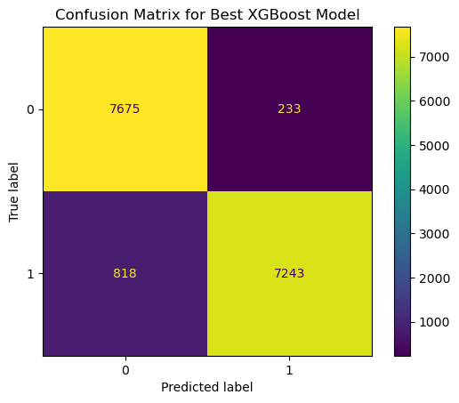
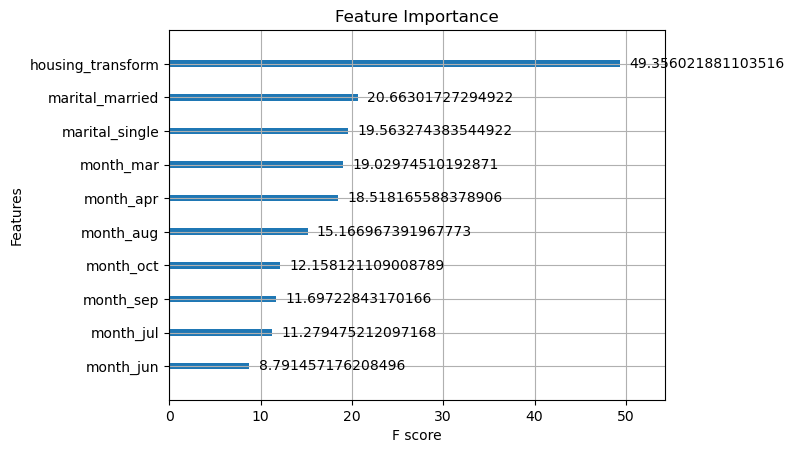

# Predicting Bank Marketing Campaign Success

## 📝 Project Overview

This project focuses on building a predictive model to determine whether a customer will subscribe to a term deposit based on their attributes and past interactions with a bank. Using the **UCI Bank Marketing Dataset**, we applied machine learning techniques, explored data patterns, and derived actionable insights.

### **Key Highlights**

- **Goal**: Predict term deposit subscription (`yes` or `no`).
- **Dataset**: UCI Bank Marketing Dataset ([Link](https://archive.ics.uci.edu/dataset/222/bank+marketing)).
- **Techniques**: Data preprocessing, feature engineering, exploratory data analysis (EDA), hyperparameter tuning.
- **Best Model**: XGBoost, with an **F1-Macro Score of 0.9324** and **ROC-AUC of 0.9345** after hyperparameter tuning.

---

## 📂 Dataset Description

The dataset consists of direct marketing campaigns (phone calls) conducted by a Portuguese banking institution. The goal is to predict whether a client will subscribe to a term deposit (`y`).

### **Features**

The dataset contains **17 input features**:

- **Client Information**: `age`, `job`, `marital`, `education`, `default`, `balance`, `housing`, `loan`.
- **Last Contact Details**: `contact`, `day`, `month`, `duration`.
- **Campaign Performance Metrics**: `campaign`, `pdays`, `previous`, `poutcome`.
- **Target Variable**: `y` (`yes` or `no` for term deposit subscription).

### **Dataset Source**

- [UCI Machine Learning Repository](https://archive.ics.uci.edu/dataset/222/bank+marketing)

---

## 🛠️ Project Pipeline

1. **Exploratory Data Analysis (EDA)**:

   - Visualized distributions, relationships, and correlations.
   - Analyzed class imbalance in the target variable.

2. **Data Preprocessing**:

   - Handled missing values and inconsistent data.
   - Encoded categorical variables using one-hot encoding and label encoding.
   - Standardized numerical features for model compatibility.

3. **Feature Engineering**:

   - Selected important features using tree-based importance metrics.
   - Handled class imbalance with SMOTE (Synthetic Minority Oversampling Technique).

4. **Model Development**:

   - Baseline model: Logistic Regression.
   - Advanced models: Random Forest and XGBoost.
   - Hyperparameter tuning using `RandomizedSearchCV`.

5. **Evaluation**:

   - Evaluated models using metrics like F1-score, ROC-AUC, and confusion matrix.
   - XGBoost yielded the best performance with optimal hyperparameters.

6. **Insights and Recommendations**:
   - Identified key factors influencing term deposit subscription.
   - Provided actionable recommendations for targeted marketing.

---

## 🔍 Key Findings

- **Model Performance**:

  - Best Model: XGBoost
  - **F1-Macro Score**: 0.9324
  - **ROC-AUC Score**: 0.9345

- **Feature Importance**:

  - The most influential features were `housing` (has housing loan?), `marital_married` (is married?), `marital_single` (is single?), `month_mar` (is March?), and `month_apr` (is April?).

- **Class Imbalance**:
  - Addressed severe class imbalance using SMOTE, ensuring the model performed well on both classes.

---

## 📊 Visualizations

- **Confusion Matrix**:
  - Showcases the performance of the best model on test data.
    
- **Feature Importance Plot**:
  - Highlights key drivers of term deposit subscription.
    

---

## 🖥️ Technology Stack

- **Programming Language**: Python
- **Libraries**:
  - Data Processing: `pandas`, `numpy`
  - Visualization: `matplotlib`, `seaborn`, `missingno`
  - Machine Learning: `scikit-learn`, `XGBoost`
  - Imbalance Handling: `imblearn`

---

## 📁 Repository Structure

```
📂 bank-marketing-prediction
├── 📄 README.md                # Project documentation
├── 📄 Analysis.ipynb           # EDA, model training, and analysis
├── 📄 best_xgboost_model.pkl   # Saved XGBoost model
├── 📊 Confusion-Matrix         # Confusion Matrix image
├── 📊 Feature-Importance       # Feature Importance image
```

---

## 🚀 How to Run

1. Clone the repository:
   ```bash
   git clone https://github.com/yourusername/bank-marketing-prediction.git
   cd bank-marketing-prediction
   ```
2. Install dependencies:
   ```bash
   pip install -r requirements.txt
   ```
3. Run the Jupyter Notebooks for EDA and Model Training:
   ```bash
   jupyter notebook eda_notebook.ipynb
   jupyter notebook model_training.ipynb
   ```

---

## 🔗 References

- [UCI Bank Marketing Dataset](https://archive.ics.uci.edu/dataset/222/bank+marketing)
- [XGBoost Documentation](https://xgboost.readthedocs.io/)
- [Scikit-learn Documentation](https://scikit-learn.org/)

---

## ✍️ Authors

- **Aditya Kulkarni**

  - LinkedIn: [@aditya-s-kulkarni](https://www.linkedin.com/in/aditya-s-kulkarni/)
  - GitHub: [@Aditya-k-23](https://github.com/Aditya-k-23)
  - Website: [adityakulkarni.me](https://adityakulkarni.me)

- **Anaqi Amir**
  - LinkedIn: [@anaqi-amir](https://www.linkedin.com/in/anaqi-amir/)
  - GitHub: [@AnaqiAmir](https://github.com/AnaqiAmir)
